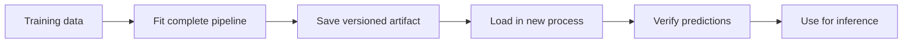

# Saving and Loading Model Pipelines {#sec-saving-and-loading-model-pipelines}

::: {.cdi-message}
- **ID:** MD-L03
- **Type:** Model persistence
- **Audience:** Beginner & Intermediate
- **Theme:** Preserve preprocessing and prediction together
:::

Chapter 02 developed a deployment candidate as one fitted scikit-learn `Pipeline`: an eight-feature input contract, `StandardScaler`, and logistic regression. The next requirement is persistence—saving that fitted pipeline so another Python process can load it and reproduce the same predictions.

This chapter saves the complete fitted pipeline, records the information needed to identify and use it, reloads it in a clean step, and verifies that serialization has not changed its behaviour.

## Learning objectives

By the end of this chapter, you will be able to:

- explain why preprocessing and prediction must be saved together;
- distinguish a fitted in-memory object from a persistent model artifact;
- save and load a scikit-learn pipeline with `joblib`;
- attach version and input-contract metadata to a model artifact;
- verify that predictions and probabilities survive a save–load round trip; and
- recognize the compatibility and security limits of pickle-based formats.

## From a fitted object to a deployable artifact

Training produces a fitted Python object in memory. That object disappears when the process ends. A deployment service, batch job, or test suite therefore needs a persistent file from which it can reconstruct the fitted object.



The saved file is not merely a convenient copy. It is the exact model candidate that later chapters will use for batch inference and API predictions.

## Save the complete pipeline

The Chapter 02 candidate contains two fitted steps:

1. `StandardScaler` stores the means and scales learned from the training data.
2. `LogisticRegression` stores the fitted coefficients, intercept, and class order.

Saving only the classifier would discard the fitted preprocessing state. A future service might then scale inputs differently—or not scale them at all—and silently produce different predictions.

The deployment unit is therefore the complete fitted pipeline:

```python
pipeline = Pipeline(
    steps=[
        ("scale", StandardScaler()),
        (
            "classifier",
            LogisticRegression(max_iter=1000, random_state=42),
        ),
    ]
)

pipeline.fit(X_train, y_train)
```

After fitting, both steps carry learned state. The pipeline also exposes the classifier's class order through `pipeline.classes_`. This matters because probability columns must always be resolved from the fitted classes rather than assumed from position.

## Define the model artifact

A model file alone cannot explain its intended inputs, version, or training environment. This guide stores a small artifact bundle containing the fitted pipeline and the metadata needed by downstream code.

The bundle contains:

| Field | Purpose |
|---|---|
| `pipeline` | Complete fitted preprocessing and classification workflow |
| `model_version` | Stable identifier returned with predictions |
| `feature_names` | Ordered eight-feature input contract |
| `target_names` | Mapping from encoded classes to readable labels |
| `trained_at_utc` | UTC timestamp for traceability |
| `python_version` | Python version used to create the artifact |
| `scikit_learn_version` | scikit-learn version used to fit and save it |

The feature order remains the contract established in Chapter 02:

```python
FEATURE_NAMES = [
    "mean radius",
    "mean texture",
    "mean perimeter",
    "mean area",
    "mean smoothness",
    "mean compactness",
    "mean concavity",
    "mean concave points",
]
```

The target mapping is:

```python
TARGET_NAMES = {
    0: "malignant",
    1: "benign",
}
```

Explicit metadata prevents later code from having to guess what the artifact expects.

## Save with `joblib`

`joblib` provides a convenient persistence format for Python objects containing large NumPy arrays. It uses Python's pickle protocol underneath, so it preserves the fitted scikit-learn pipeline as a Python object.

```python
from datetime import datetime, timezone
from pathlib import Path
import platform

import joblib
import sklearn


MODEL_PATH = Path("models/03-breast-cancer-pipeline.joblib")
MODEL_VERSION = "breast-cancer-logistic-v1"

artifact = {
    "pipeline": pipeline,
    "model_version": MODEL_VERSION,
    "feature_names": FEATURE_NAMES,
    "target_names": TARGET_NAMES,
    "trained_at_utc": datetime.now(timezone.utc).isoformat(),
    "python_version": platform.python_version(),
    "scikit_learn_version": sklearn.__version__,
}

MODEL_PATH.parent.mkdir(parents=True, exist_ok=True)
joblib.dump(artifact, MODEL_PATH)
```

The `models/` directory is created if necessary. `joblib.dump()` then serializes the bundle to one file. The timestamp documents when the artifact was created; it does not by itself guarantee reproducibility, so the repository's dependency lock file and source code must also be retained.

::: {.callout-note}
The chapter number in the filename makes the artifact's origin visible during development. The semantic `model_version` identifies the model itself and is the value that downstream predictions should report.
:::

## Load and validate the artifact

Loading reverses the serialization step:

```python
loaded_artifact = joblib.load(MODEL_PATH)
loaded_pipeline = loaded_artifact["pipeline"]
```

Before using the model, validate the artifact structure rather than assuming every required field is present.

```python
REQUIRED_ARTIFACT_KEYS = {
    "pipeline",
    "model_version",
    "feature_names",
    "target_names",
    "trained_at_utc",
    "python_version",
    "scikit_learn_version",
}

missing_keys = REQUIRED_ARTIFACT_KEYS - loaded_artifact.keys()
if missing_keys:
    raise ValueError(
        f"Model artifact is missing required keys: {sorted(missing_keys)}"
    )

if loaded_artifact["feature_names"] != FEATURE_NAMES:
    raise ValueError("Saved feature contract does not match the application contract.")
```

These checks fail early if a wrong, incomplete, or incompatible artifact is placed at the expected path.

## Verify the save–load round trip

A successful file write does not prove that the reloaded artifact behaves correctly. Compare predictions made immediately before saving with predictions made after loading.

```python
import numpy as np


predictions_before = pipeline.predict(X_test)
probabilities_before = pipeline.predict_proba(X_test)

predictions_after = loaded_pipeline.predict(X_test)
probabilities_after = loaded_pipeline.predict_proba(X_test)

if not np.array_equal(predictions_before, predictions_after):
    raise RuntimeError("Class predictions changed after serialization.")

if not np.allclose(probabilities_before, probabilities_after):
    raise RuntimeError("Class probabilities changed after serialization.")
```

`np.array_equal()` requires identical class predictions. `np.allclose()` is appropriate for floating-point probabilities, where numerically negligible representation differences may occur.

Also verify that the class labels retained their expected meaning:

```python
expected_classes = np.array([0, 1])

if not np.array_equal(loaded_pipeline.classes_, expected_classes):
    raise RuntimeError(
        f"Unexpected fitted class order: {loaded_pipeline.classes_.tolist()}"
    )
```

The malignant-class probability can then be selected safely:

```python
malignant_class = 0
malignant_index = np.where(
    loaded_pipeline.classes_ == malignant_class
)[0].item()

malignant_probability = probabilities_after[:, malignant_index]
```

This repeats an important deployment rule from Chapter 02: resolve a probability column from `classes_`; never assume its position.

## Run the complete persistence workflow

The executable program for this chapter is:

```text
scripts/python/03-save-and-load-model-pipeline.py
```

It performs the complete workflow:

1. loads the same scikit-learn breast cancer dataset used in Chapter 02;
2. selects and validates the same eight features;
3. recreates the same stratified training and test split;
4. fits the same scaling and logistic regression pipeline;
5. saves the fitted pipeline and its metadata;
6. reloads and validates the artifact; and
7. confirms that predictions and probabilities are unchanged.

From the repository root, with the project environment activated, run:

```bash
python scripts/python/03-save-and-load-model-pipeline.py
```

The expected artifact is:

```text
models/03-breast-cancer-pipeline.joblib
```

Inspect the result without trying to print the binary file:

```bash
ls -lh models/03-breast-cancer-pipeline.joblib
```

The program should report the saved path, model version, fitted class order, and successful round-trip verification.

## Why the chapter script fits the model again

Chapter 02 evaluated whether the pipeline was suitable as a deployment candidate. Chapter 03 creates the persistent artifact. The chapter script deliberately rebuilds the candidate from the same deterministic training definition before saving it.

This keeps the persistence workflow reproducible from source and avoids depending on an undocumented in-memory object left behind by another process. In a larger production system, training and artifact publication would normally be separate pipeline stages sharing reusable project modules. The compact guide keeps that orchestration visible within one executable program.

## Compatibility is part of the artifact

Pickle-based model files are tied to Python and the libraries that define the stored objects. Loading an artifact under substantially different Python, NumPy, SciPy, or scikit-learn versions may fail or produce unsupported behaviour.

For this guide:

- create and use the repository-specific `.venv`;
- install the project's declared dependencies;
- retain the dependency lock file used for the build;
- record the Python and scikit-learn versions in the artifact; and
- rebuild and revalidate the model when dependencies change.

The version metadata helps diagnose a mismatch, but it does not make incompatible environments compatible.

## Treat model files as trusted code

::: {.callout-warning}
Never load an untrusted `.joblib`, `.pkl`, or other pickle-based file. Loading can execute arbitrary code embedded in the serialized object. Only load artifacts created by a trusted training workflow and stored in a controlled location.
:::

In a production workflow, access controls, artifact checksums, signed releases, or a model registry can provide stronger provenance. Those controls are outside this guide's local example, but the trust boundary applies from the beginning.

## Common persistence mistakes

### Saving only the classifier

This loses the fitted scaler and breaks the relationship between training and inference. Save the complete pipeline.

### Recreating preprocessing during inference

Hand-written preprocessing can drift from training logic. Call `predict()` or `predict_proba()` on the loaded pipeline and let the pipeline apply its stored transformations.

### Depending on feature position without a contract

A numeric array can contain the right values in the wrong order. Store the ordered feature names and validate incoming data before prediction.

### Assuming a probability column

The first or second column is not inherently malignant or benign. Resolve the column from `loaded_pipeline.classes_`.

### Overwriting an artifact without changing its version

If model parameters, training data, preprocessing, or the feature contract changes, publish a new model version. A version should identify one reproducible model definition.

### Loading across unverified environments

Matching filenames do not guarantee library compatibility. Record versions and rerun the verification suite after environment changes.

## Persistence checklist

Before an artifact is used for inference, confirm that:

- [ ] the complete fitted pipeline was saved;
- [ ] the ordered feature contract is stored and validated;
- [ ] the class-label mapping is explicit;
- [ ] the model has a stable semantic version;
- [ ] Python and scikit-learn versions are recorded;
- [ ] predictions match before and after loading;
- [ ] probabilities match before and after loading;
- [ ] the fitted class order is checked; and
- [ ] the artifact comes from a trusted source.

## Chapter summary

Model persistence is the boundary between training and operational inference. A reliable artifact preserves the complete fitted pipeline, the ordered feature contract, the class meanings, the model version, and enough environment information to diagnose compatibility problems.

The round-trip verification provides concrete evidence that the saved and reloaded pipeline behaves like the fitted deployment candidate. Chapter 04 will build on this artifact by creating a reliable inference workflow that validates new records, preserves feature order, and returns structured predictions.
