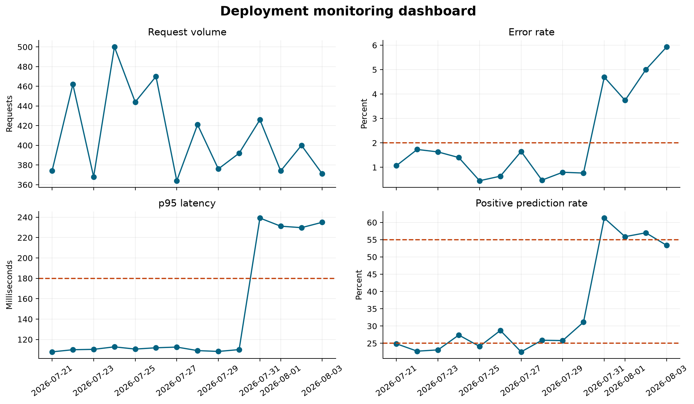
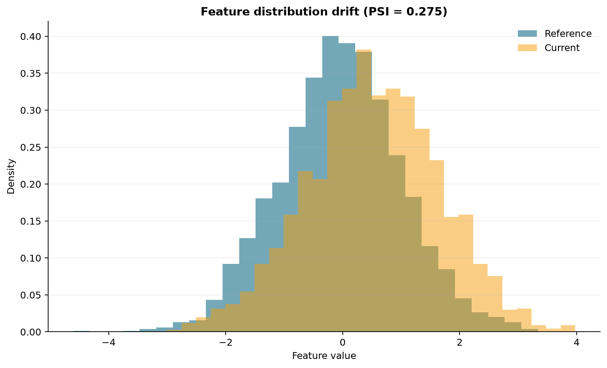

# Deployment Monitoring and Maintenance {#sec-deployment-monitoring-and-maintenance}

::: {.cdi-message}
- **ID:** MD-L08
- **Type:** Model operations
- **Audience:** Intermediate
- **Theme:** Observe change and maintain confidence after release
:::

Deploying a model is not the end of the workflow. It is the point at which assumptions made during development begin to meet changing data, real users, network failures, and operational constraints. A healthy service must therefore be observed continuously and maintained deliberately.

This chapter develops a small, reproducible monitoring workflow. It records inference events, aggregates service and prediction signals, checks explicit thresholds, examines feature drift, and produces artifacts that can support investigation.

## Learning objectives

By the end of this chapter, you should be able to:

- distinguish service, data, prediction, and performance monitoring;
- design useful inference logs without storing unnecessary sensitive data;
- aggregate raw events into time-windowed monitoring metrics;
- define warning and critical thresholds before incidents occur;
- detect feature drift and interpret it cautiously;
- connect alerts to investigation, rollback, and retraining decisions; and
- maintain a model through a documented lifecycle.

## Monitoring is a layered problem

No single metric can establish that a deployed model is healthy. Monitoring should cover several related layers.

| Layer | Example signals | Question answered |
|---|---|---|
| Service | request count, error rate, latency | Is the API available and responsive? |
| Data quality | missingness, range violations, schema failures | Are requests usable and structurally valid? |
| Feature distribution | summary statistics, category proportions, drift scores | Does current input resemble the reference population? |
| Predictions | class balance, score distribution, abstention rate | Has model behaviour changed? |
| Model performance | accuracy, recall, calibration, subgroup metrics | Is the model still correct when outcomes become available? |
| Operations | model version, deployment age, alert status | Can a change be traced and acted upon? |

Service health and model quality are different. An API can return HTTP 200 quickly while producing increasingly unreliable predictions. Conversely, a statistically stable model can still be unusable when the service has high latency or frequent failures.

## Design an inference event

A monitoring event should contain enough information to reconstruct what happened without becoming an uncontrolled copy of every request. A practical event might include:

```json
{
  "timestamp": "2026-08-04T08:15:00Z",
  "request_id": "req-4a81",
  "model_version": "churn-pipeline-1.2.0",
  "status_code": 200,
  "latency_ms": 43.7,
  "prediction": 1,
  "probability": 0.78,
  "features": {
    "tenure_months": 7,
    "monthly_charges": 84.5
  }
}
```

In a real system, apply data minimisation. Avoid logging direct identifiers, secrets, free text, or sensitive attributes unless they are genuinely required and protected. A pseudonymous request identifier can support tracing without exposing a person's identity. Define retention periods and access controls for logs just as carefully as for training data.

## Produce structured logs in FastAPI

The endpoint can record one structured event after every prediction. The exact logging backend may vary, but the application should emit machine-readable fields consistently.

```python
import logging
import time
from uuid import uuid4

logger = logging.getLogger("model_api")


@app.post("/predict", response_model=PredictionResponse)
def predict(payload: PredictionRequest) -> PredictionResponse:
    started = time.perf_counter()
    request_id = str(uuid4())

    probability = float(model.predict_proba(payload.to_frame())[0, 1])
    prediction = int(probability >= 0.5)
    latency_ms = (time.perf_counter() - started) * 1_000

    logger.info(
        "prediction_completed",
        extra={
            "request_id": request_id,
            "model_version": MODEL_VERSION,
            "status_code": 200,
            "latency_ms": round(latency_ms, 2),
            "prediction": prediction,
            "probability": round(probability, 6),
        },
    )

    return PredictionResponse(
        prediction=prediction,
        probability=probability,
        model_version=MODEL_VERSION,
    )
```

Do not let monitoring failures make the prediction endpoint unreliable. Production logging and metric exporters should use bounded buffers, sensible timeouts, and failure handling appropriate to the service.

## Build the chapter monitoring demonstration

The chapter script simulates fourteen days of inference activity. The final days introduce higher latency, more errors, increased missingness, a change in one feature distribution, and a shift in the positive prediction rate. This creates known behaviour against which the monitoring calculations can be checked.

Run the workflow from the repository root:

```bash
python scripts/python/08-monitor-deployment.py
```

Alternatively, use the Bash wrapper:

```bash
bash scripts/bash/08-monitor-deployment.sh
```

The workflow writes:

- `results/08-inference-events.csv` — simulated request-level records;
- `results/08-daily-monitoring-metrics.csv` — daily aggregates;
- `results/08-monitoring-alerts.csv` — threshold evaluation results;
- `results/08-drift-summary.csv` — feature drift statistics;
- `results/figures/08-monitoring-dashboard.png`; and
- `results/figures/08-feature-drift.png`.

## Aggregate signals over useful windows

Individual events are necessary for tracing, but operational decisions are usually based on rolling or fixed windows. For each day, the demonstration calculates:

```python
daily = events.groupby("date", as_index=False).agg(
    requests=("request_id", "size"),
    error_rate=("is_error", "mean"),
    p95_latency_ms=("latency_ms", lambda x: x.quantile(0.95)),
    missing_rate=("feature_missing", "mean"),
    positive_rate=("prediction", "mean"),
    mean_probability=("probability", "mean"),
)
```

The aggregation window should match the decision. A five-minute window may be suitable for service outages; daily or weekly windows may be more stable for population drift. Very small windows can trigger noise, while very large windows can hide abrupt changes.

{#fig-monitoring-dashboard fig-alt="Four-panel deployment monitoring dashboard with daily request count, error rate, p95 latency, and positive prediction rate."}

The dashboard combines related signals without collapsing them into one score. A rise in latency and errors suggests an operational incident. A changed prediction rate without service degradation suggests a data or model-behaviour investigation.

## Define alerts as testable rules

An alert should identify a condition, severity, observation window, owner, and expected action. Thresholds in this demonstration are deliberately simple:

| Metric | Warning condition | Example first response |
|---|---:|---|
| Error rate | greater than 2% | inspect API and dependency errors |
| p95 latency | greater than 180 ms | inspect resource use and downstream calls |
| Missing feature rate | greater than 3% | validate upstream data pipeline |
| Positive prediction rate | outside 25%–55% | compare inputs and score distribution with reference |

Thresholds must reflect the application rather than universal conventions. Establish baselines from representative traffic, account for expected seasonality, and tune rules using the operational cost of missed and false alerts.

A simple rule evaluator can retain both healthy and breached checks:

```python
alerts = []
for row in daily.itertuples(index=False):
    alerts.append({
        "date": row.date,
        "metric": "error_rate",
        "value": row.error_rate,
        "threshold": 0.02,
        "status": "ALERT" if row.error_rate > 0.02 else "OK",
    })
```

In production, avoid sending one notification per event. Require a sustained breach, group related alerts, apply cooldown periods, and route notifications to a named owner. Every alert should link to a runbook.

## Detect feature drift

Feature drift occurs when the distribution of inputs changes relative to a reference period. It can be measured even before true outcomes are available. The demonstration compares the first seven days with the final seven days.

For a numeric feature, the population stability index (PSI) divides the reference distribution into bins and compares reference and current proportions:

$$
\operatorname{PSI} = \sum_{i=1}^{k}(p_i-q_i)\log\left(\frac{p_i}{q_i}\right),
$$

where $p_i$ is the current proportion and $q_i$ is the reference proportion in bin $i$. Small constants are used in software to avoid taking the logarithm of zero.

{#fig-feature-drift fig-alt="Two overlapping histograms comparing reference and current feature values and reporting the calculated PSI."}

PSI is a diagnostic, not proof that performance has degraded. Its value depends on binning, sample size, and the reference window. Complement it with domain review, distribution plots, missingness checks, and other suitable statistical distances.

## Drift, concept drift, and performance decay

These conditions should not be treated as synonyms:

- **Data drift** means the input distribution has changed.
- **Prediction drift** means scores or predicted classes have changed.
- **Concept drift** means the relationship between inputs and the target has changed.
- **Performance decay** means the model's measured predictive quality has worsened.

Input and prediction drift can be observed immediately. Concept drift and performance decay normally require delayed ground-truth outcomes. Therefore, the monitoring system should support later joining predictions to verified outcomes using a safe event key.

When labels arrive, calculate the same decision-relevant metrics used during evaluation, including subgroup metrics where appropriate. Preserve the prediction, model version, and decision threshold that were active at inference time; otherwise a retrospective evaluation may not represent what the deployed system actually did.

## Investigate before retraining

Retraining is only one possible response to an alert. Use a structured sequence:

1. Confirm that the alert is genuine and sufficiently sustained.
2. Check recent deployments, configuration changes, and dependency failures.
3. Validate schemas, missingness, units, categories, and upstream transformations.
4. Segment the signal by model version, client, geography, or other safe operational dimensions.
5. Compare current features, predictions, and—when available—outcomes with the reference period.
6. Decide whether to continue, mitigate, roll back, recalibrate, adjust a threshold, or retrain.
7. Record the incident, evidence, decision, owner, and follow-up action.

Automatic retraining can amplify data-quality failures if it is triggered without validation. A safer workflow uses eligibility checks, reproducible training, evaluation gates, approval, staged deployment, and rollback capability.

## Maintain a model lifecycle record

Each production model should have traceable metadata:

| Record | Minimum useful content |
|---|---|
| Model version | immutable identifier and artifact checksum |
| Training provenance | dataset snapshot, code revision, dependencies, parameters |
| Evaluation | metrics, slices, thresholds, limitations, approval decision |
| Deployment | environment, date, traffic allocation, configuration |
| Monitoring | baselines, alert rules, dashboards, responsible owner |
| Incidents | symptoms, impact, diagnosis, mitigation, follow-up |
| Retirement | replacement or withdrawal reason and archive location |

A maintenance schedule should include dependency updates, vulnerability review, backup and rollback tests, model review dates, and confirmation that monitoring still reflects current risks.

## Practical interpretation checklist

Before acting on a monitoring signal, ask:

- Is the metric defined from valid, complete events?
- Is the reference period representative and version-matched?
- Is the change large enough and sustained long enough to matter?
- Could traffic volume, seasonality, or a changed client explain it?
- Does the change affect all requests or a specific segment?
- Are true outcomes available, and are they joined without leakage?
- What is the safest reversible response?
- Who owns the decision and how will it be documented?

## Chapter summary

Reliable deployment requires observing both the software service and the statistical system. Structured inference events provide the raw evidence; time-windowed metrics make behaviour interpretable; thresholds make expectations testable; drift analysis identifies distribution changes; and delayed outcomes reveal whether predictive performance still meets its purpose.

Monitoring creates signals, not automatic conclusions. Effective maintenance combines those signals with investigation, versioned evidence, clear ownership, cautious retraining, and a tested rollback path.

## Exercises

1. Add a `model_version` grouping to the daily monitoring report and compare two simulated versions.
2. Require two consecutive daily threshold breaches before an alert becomes critical.
3. Add a categorical feature and calculate a distribution-distance measure for it.
4. Simulate delayed outcomes and extend the report with daily recall and calibration error.
5. Draft a one-page runbook for an increased missing-feature alert.

