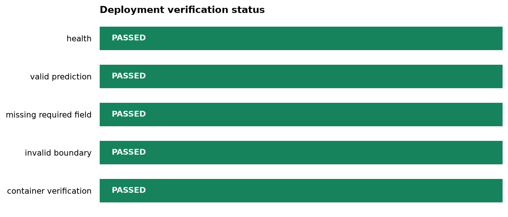

# End-to-End Deployment Case Study {#sec-end-to-end-deployment-case-study}

::: {.cdi-message}
- **ID:** MD-L09
- **Status:** Complete
- **Theme:** Rebuild and verify the complete deployment path
:::

## Learning objectives

By the end of this chapter, you should be able to:

- connect model training, serialization, inference, API serving, validation, testing, containerization, and monitoring;
- distinguish build-time checks from run-time checks;
- execute the deployment workflow with one reproducible command;
- preserve verification results as machine-readable evidence; and
- decide whether a candidate is ready for release.

## The case study

The earlier chapters developed the deployment system one layer at a time. This chapter treats those layers as one release candidate. The objective is not to build a second application. It is to verify that the same fitted pipeline can move from a saved artifact to a tested service without changing its preprocessing or prediction logic.

The complete path is:

```{mermaid}
flowchart TD
    A[Training data] --> B[Fit preprocessing and model]
    B --> C[Serialized pipeline]
    C --> D[Inference function]
    D --> E[FastAPI service]
    E --> F[API and contract tests]
    F --> G[Container image]
    G --> H[Health and prediction probes]
    H --> I[Monitoring evidence]
```

The serialized pipeline is the boundary between model development and serving. Preprocessing must remain inside that pipeline so that training and inference apply the same transformations.

## Release acceptance criteria

A deployment candidate is accepted only when all required checks pass.

| Layer | Evidence | Acceptance criterion |
|---|---|---|
| Artifact | Saved model pipeline | File exists and loads successfully |
| Inference | Direct Python prediction | Valid input returns the expected output structure |
| Application | FastAPI app | Application imports without startup errors |
| Health | `/health` | HTTP 200 and a healthy status |
| Prediction | `/predict` | Valid request returns HTTP 200 |
| Validation | Invalid requests | Rejected with HTTP 422 |
| Tests | Automated test suite | All required tests pass |
| Container | Docker image and container | Image builds and probes pass |
| Operations | Structured report | Results are written for review and monitoring |

The gate is intentionally strict: one failed required check means the candidate is not ready. A successful health response alone does not prove that the model can make predictions.

## Preserve one prediction contract

The valid request used in Chapter 06 should remain the canonical smoke-test request. Store it in `data/reference/valid-prediction-request.json` so that local tests, container tests, and operational probes use the same input.

For example:

```json
{
  "feature_1": 0.25,
  "feature_2": 1.75,
  "feature_3": 8.0
}
```

Replace the illustrative fields above with the fields defined by the application's Pydantic request model. Do not maintain slightly different payloads in several scripts; contract drift is easier to prevent when there is one reference file.

## Run the complete workflow

The Bash orchestrator runs the repository's established chapter scripts in release order. From the repository root, run:

```bash
bash scripts/bash/09-run-end-to-end-deployment.sh
```

By default, the workflow performs local checks. Add `--with-container` when Docker is available and the release candidate must also be verified in a container:

```bash
bash scripts/bash/09-run-end-to-end-deployment.sh --with-container
```

The orchestrator uses existing scripts when they are present rather than duplicating their logic. This preserves the chapter progression:

1. verify or create the serialized model;
2. run the automated Python tests;
3. start the API and wait for readiness;
4. execute the Chapter 06 API contract tests;
5. optionally build and test the container; and
6. summarize the evidence in a report and figure.

If a required command fails, the script exits immediately. This behaviour makes the workflow suitable for a local release gate and, later, for continuous integration.

## Generate the verification report

After the checks finish, the reporting script converts their evidence into a consistent JSON summary and a readiness figure:

```bash
python scripts/python/09-summarize-deployment-verification.py \
  --api-report results/06-api-test-results.json \
  --output results/09-deployment-verification.json \
  --figure results/figures/09-deployment-readiness.png
```

The script records each check as `passed`, `failed`, `skipped`, or `not_run`. Skipped optional container checks remain visible and are not silently reported as successes.

```python
# Illustrative structure of the generated report.
report = {
    "overall_status": "passed",
    "checks": [
        {"name": "health", "status": "passed", "http_status": 200},
        {"name": "valid_prediction", "status": "passed", "http_status": 200},
        {"name": "missing_required_field", "status": "passed", "http_status": 422},
    ],
}
```

When the generated figure exists, include it in the rendered guide:

{#fig-deployment-readiness fig-alt="Horizontal status bars summarizing the deployment verification checks."}

The figure is a communication aid, while the JSON file is the auditable source. Automated systems should consume the JSON rather than infer status from image colours.

## Inspect failures by layer

An end-to-end failure becomes easier to diagnose when it is assigned to the layer that first failed.

| Symptom | Likely layer | First inspection |
|---|---|---|
| Model file is missing | Build/artifact | Training and serialization command |
| Model loads locally but API import fails | Application | Import path, lifespan code, and configuration |
| Health passes but prediction fails | Contract or inference | Request fields, types, feature order, and model input |
| Local API passes but container fails | Packaging | Docker build context, copied files, paths, and port |
| Valid input returns 422 | Contract | Reference JSON compared with the Pydantic schema |
| Invalid input returns 200 | Validation | Field constraints and request model |
| Container works but later probes fail | Operations | Logs, resource limits, dependency health, and model availability |

Always inspect the earliest failing layer. Later failures are often consequences rather than independent defects.

## Separate build-time and run-time verification

Build-time checks answer whether the release candidate was assembled correctly. Run-time checks answer whether the deployed process remains available and useful.

### Build-time checks

- dependencies install in the project environment;
- tests pass;
- the model artifact loads;
- the application imports;
- the container image builds; and
- the reference request satisfies the API contract.

### Run-time checks

- the process remains alive;
- the health endpoint responds;
- predictions succeed within an acceptable latency;
- validation failures are visible but do not crash the service;
- error rates and latency remain within operational thresholds; and
- input or prediction distributions are reviewed for meaningful change.

The Chapter 09 report is release evidence, not a replacement for continuing monitoring after deployment.

## Reproducibility checklist

Before declaring the case study complete, confirm that:

- [ ] the repository-specific `.venv` is active;
- [ ] dependencies are installed from the repository requirements file;
- [ ] the serialized pipeline was produced by the documented training script;
- [ ] the application loads the artifact from a stable repository-relative path;
- [ ] one canonical valid request is stored under `data/reference/`;
- [ ] direct inference, API tests, and container tests use the same feature contract;
- [ ] invalid input produces HTTP 422 rather than an internal server error;
- [ ] the container is tested when it is part of the intended release;
- [ ] JSON evidence and the readiness figure are regenerated; and
- [ ] generated outputs are reviewed before committing or publishing them.

## What this case study demonstrates

Deployment is not the act of placing a model behind an endpoint. It is a chain of contracts: data to pipeline, pipeline to inference function, inference function to API, API to container, and running service to operational evidence. The release is dependable only when those contracts are tested together.

The workflow in this chapter provides a reproducible minimum release gate. It can later be transferred to continuous integration, a container registry, and a managed deployment platform without changing the underlying principles.

## Chapter summary

This chapter rebuilt the full deployment path as one verified release candidate. The Bash orchestrator reuses the earlier chapter scripts, while the Python reporter turns test evidence into JSON and a readiness figure. Required failures block release; optional checks are recorded explicitly; and operational monitoring continues after the release gate has passed.
